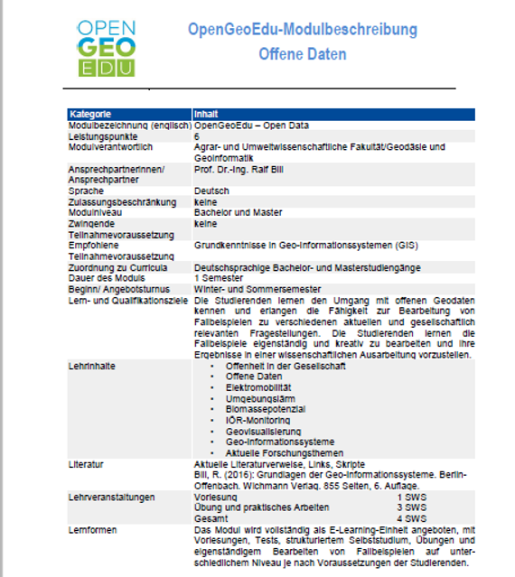

Um Ihnen den Einstieg in die OpenGeoEdu-Lerneinheiten zu erleichtern, bieten wir Ihnen verschiedene Werkzeuge und Hilfestellungen an:

*	eine Selbsteinschätzung: Nachdem Sie Ihre Kenntnisse und Fähigkeiten einigermaßen realistisch eingeschätzt haben, erhalten Sie Hinweise zu den Kurseinheiten, die wir für sinnvoll erachten.

*	einen Workloadrechner: Durch Auswahl der von Ihnen für eine Bearbeitung geplanten Kursteile wird der damit verbundene Workload abgeschätzt. Der dann durch Bearbeitung nachgewiesene Workload wird im OpenGeoEdu-Zertifikat dokumentiert.

*	eine Modulbeschreibung: Konform zu Modulbeschreibungen in Ihren Bachelor- oder Masterstudiengängen finden Sie hier eine Modulbeschreibung zum offenen online Kurs OpengeoEdu.

*	Datenblätter: Ein Datenblatt beschreibt eine Übungsaufgabe systematisch und ausführlich.

    

        

              <h5 class="card-title">Selbsteinschätzung (in Arbeit)</h5>
            

            

                <small class="text-muted"></small>
            

            

            
            

            
        

    

    

        

              <h5 class="card-title">Workloadrechner (in Arbeit)</h5>
            

            

                <small class="text-muted"></small>
            

            

            
            

            
        

    

    

        

              <h5 class="card-title">Modulbeschreibung (in Arbeit)</h5>
            

            

                <small class="text-muted"></small>
            

            

            
            

            
        

    

<!-- # Selbsteinschätzung (in Arbeit)

# Workloadrechner (in Arbeit)

## Modulbeschreibung (in Arbeit)

[Modulbeschreibung](OGE_Modulbeschreibung.pdf)
-->
