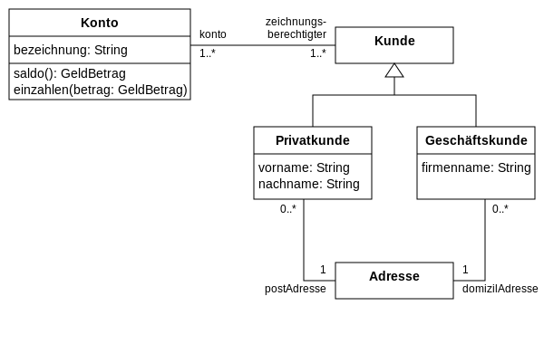

Im vorherigen Übungsschritt haben wir erkundet, was für Daten verfügbar sind, und entschieden, welche dieser Daten wir nutzen wollen. Nun haben wir mehrere Datensätze aus verschiedenen Quellen, möglicherweise mit Attributen die wir für unsere Auswertungen auf keinen Fall benötigen, oder die einfach leer sind, besonders im Fall von OSM-Daten.

Bevor wir nun nach Augenmaß Datensätze entfernen und rekombinieren, sollte man sich lieber genauere Gedanken machen was genau benötigt wird. Besonders für Auswertungen oder Projekte die weitaus größer sind als diese einfache Übung macht dies Sinn. Da wir hier mit offenen Daten arbeiten, und wir diese idealerweise auch zur weiteren Nutzung veröffentlichen wollen, ist es nur angebracht einen entsprechenden offenen Standard für diese Überlegungen zu nutzen.

Das Ergebnis dieser Überlegungen sollte also eine gut durchsichtige Struktur für unsere Daten liefern. In solchen Fällen ist eine visuelle Darstellung oft effektiver als eine textuelle Beschreibung. Der Standard für grafische Modellierung ist die Unified Modeling Language (UML).

## Unified Modeling Language
Die Unified Modeling Language ist ursprünglich eine grafische Modellierungssprache für komplexe Softwaresysteme, welche es erlaubt Software zu entwerfen bevor diese programmiert wird. Sie hilft sowohl beim Spezifizieren, Visualisieren, als auch beim Dokumentieren und Testen. [1]

Nachdem sie im Bereich der Softwareentwicklung zu internationaler Verbreitung gelangt ist, hat sie sich auch in weiteren Bereichen verbreitet. Fast jedes komplexe System das von größeren Gruppen entwickelt und genutzt werden soll profitiert von einer guten Modellierung. Das am weitesten verbreitete Beispiel ist hierbei sicher die Geschäftsprozessmodellierung, welche auch für größere geodatenbasierte Projekte relevant sein kann. An dieser Stelle wollen wir uns jedoch nicht auf Prozesse, sondern auf Strukturen konzentrieren.

Um dies zu illustrieren, sehen wir uns zuerst das vermutlich am weitesten verbreitete Modell der UML an: Das Klassendiagramm.
 <cite>https://de.wikipedia.org/wiki/Klassendiagramm, Author: Stkl, Lizenz: CC BY-SA 3.0</cite>