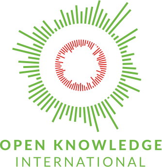

Aktuell findet ein Paradigmenwechsel zu mehr Offenheit in der Gesellschaft, der Verwaltung, der Wirtschaft und auch der Wissenschaft statt. Noch vor wenigen Jahren wurden Informationen sorgsam gehütet. Sie wurden in Unternehmen als Betriebsgeheimnis gesehen, Verwaltungen sammelten sie in Ordnern und Planschränken. Auskunftsbegehren wurden fast schon als Majestätsbeleidigung angesehen. Wissenschaftler publizierten zwar, jedoch ohne die genutzten Daten zur Verfügung zu stellen, womit die Nachvollziehbarkeit der Ergebnisse deutlich eingeschränkt war.
Dies ändert sich gerade dramatisch. Informationsfreiheit, Bürgerbeteiligung, Offene Daten, Transparenzgesetze, Digitalisierung. Neue Schlagworte und Aktivitäten, die andeuten, dass Offenheit in den unterschiedlichsten Bereichen im Vormarsch ist. 
Diese neue Form der Offenheit ist durch Begriffsbildungen mit dem Wort Open geprägt, weshalb wir in diesem Kursteil namens Open XX ausgewählte Facetten solcher Begriffsbildungen betrachten. 

> Open means anyone can freely access, use, modify,and share for any purpose (subject, at most, to requirements that preserve provenance and openness).
> <cite>OPEN KNOWLEDGE 2015</cite>

! Weiterführende Informationen unter: [Open Knowledge Foundation Deutschland](https://okfn.de/) sowie [Openall.info](http://openall.info/open-culture-offene-kultur/open-knowledge/definition/)

