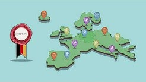

DCAT - Das Data Catalog Vocabulary ist ein sogenanntes Vokabular (engl. Vocabulary) zur Beschreibung von Datenkatalogen und ihren Inhalten. ([W3C, 2014](/opendata/literatur#world2014data)). Es basiert auf dem Resource Description Framework (RDF), eine Web-Technologie zur Modellierung von Datenstrukturen. Im Sinne der Linked Data-Idee wird DCAT verwendet um web-basierten Datenkataloge zu vereinheitlichen und systematischen Zugriffe und Vernetzung - sowohl der Daten als auch der Kataloge - zu ermöglichen.

Dieses Vokabular wurde auf Inititiave der Europäischen Commission zu [DCAT-AP](https://joinup.ec.europa.eu/solution/dcat-application-profile-data-portals-europe) weiterentwickelt, ein sogenanntes Anwendungspofil für Datenportale in Europa *(Englisch:  DCAT Application Profile for Data Portals in Europe)*. DCAT-AP wird insbesondere vom [Europäischen Datenportal](https://www.europeandataportal.eu/) verwendet, sowie von und 79 weiteren Katalogen aus 36 europäischen Ländern (Stand März 2019) die direkt mit dem Portal vernetzt sind. Die Harmonisierung der Daten mit DCAT-AP ermöglicht es, die mehr als 800.000 Datensätze mit einer einzigen Suche systematisch zu erfassen, obwohl die Daten dezentral gelagert und von verschiedensten Institutionen in verschiedenen Sprachen und Ländern bereitgestellt und aktualiseirt werden.

DCAT-AP hat wiederum verschiedene Erweiterungen, die entweder nationale Standards darstellen oder bestimmte Anwendungsfälle addressieren. Dazu zählen unter anderem

...**national (DACH)** (Siehe auch https://joinup.ec.europa.eu/document/national-extensions-analysis-dcat-ap):
- [DCAT-AP.de](https://www.dcat-ap.de) als gemeinsames deutsches Metadatenmodell zum Austausch von offenen Verwaltungsdaten
- [DCAT-AP for Switzerland](https://handbook.opendata.swiss/en/library/ch-dcat-ap) als Standard für die Schweiz (alle Textelemente müssen multilingual auf Deutsch, Englisch, Französisch und Italienisch vorliegen)
- Für Österreich gibt es dem Namen nach keine DCAT-AP Erweiterung, andererseits hat die Cooperation OGD Österreich eine einheitliche Metadatenstruktur entwickelt, die sowohl INSPIRE Spezifikationen als auch DCAT-AP berücksichtigt. (Siehe https://www.data.gv.at/katalog/dataset/metadaten_dokumenten/resource/4af3f912-3821-4183-ad7b-2a6c886fbdca)

...**anwendungssppezifisch**:
- [GeoDCAT-AP](https://joinup.ec.europa.eu/release/dcat-ap/12) definiert ein RDF- basierte Syntax (engl: Syntax Binding) für Metadatenelemente von Geographischen Informationen, die von den [ISO 19115](https://www.iso.org/search.html?q=ISO%2019115)-Normen sowie [INSPIRE-Direktive](https://inspire.ec.europa.eu/) definiert sind. Dies ermöglicht die Vernetzung von Geographischen Dateninfrastrukturen (GDIs) mit DCAT-AP- komplatiblen Datenkatalogen (z.B. sind Daten der GDI-DE auch im Europäischen Datenportal gelistet), sowie die katalogisierung von Geographischen Datensätzen mit zusätzlichen Metadatenfeldern.
- [StatDCAT-AP] zur katalogisierung statistischer Daten, entickelt in Zusammenarbeit mit [Eurostat](https://ec.europa.eu/eurostat/)

! Schauen Sie sich dieses kurze Info-Video zu DCAT-AP.de an:  

<!--
Caption: DCAT-AP.de - der Standard zum Austausch von offenen Daten der öffentlichen Verwaltung

verwendet um die Dat

und dazu genutzt, die Metadaten in

verwendet und dazu

auf ein Best

Sinn des Vokabulars ist es, in einem einheitlichen maschinenlesbaren Format (technische Interoperabilität) und mit klar definierten Metadaten-Feldern (semantische Interoperabilität) Informationen über die Datensätze, die ein Datenkatalog enthält zu erfassen. Dadurch ist es möglich, solche Kataloge systematisch zu dursuchen und Auszuwerten. Die Ansätze sind dabei übertragbar: z.B. kann der Datenkatalog des Europäischen Datenportals auf die gleiche Weise ausgewertet werden wie das deutsche Datenportal GovData.

Die Europäische Union hat DCAT weiterentwickelt

DCAT ist wird insbesondere von Open Data-Portalen der öffentlichen Verwaltung verwendet. Die

 Im Zuge nationaler oder und internationaler Bemühungen sind verschiedene Metadaten-Strukturen als Standards für Open Government Data entwickelt wurden, welche eine sogenanntes

Es gibt offizielle Standards

https://www.dcat-ap.de/def/

Do sind dem DCAT-Vokabular abgleitet sind

Bei Standisierten Schnit

 und sogar untereinander zu vernetzen. Bei einer einheitlichen Metadatenstruktur und Schnittstellen ist es auch möglich, mehrere Datenkataloge auf die gleiche Weise auszuwerten und zu dursuchen.

Metadatenmodel

https://www.govdata.de/ckan/catalog/catalog.rdf?profiles=euro_dcat_ap,dcatap_de
-->
