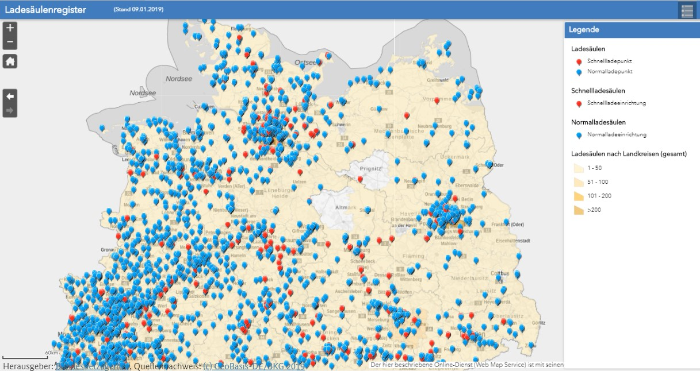

## Aktuelle Ladeinfrastruktur

Die unzureichende öffentliche Ladeinfrastruktur stellt ein wesentliches Hindernis für den erfolgreichen Übergang zur Elektromobilität dar. Laut Berechnungen der NPE (2015) sind rund 85 Prozent der benötigten Ladeinfrastruktur private Ladepunkte. Die restlichen 15 Prozent befinden sich im öffentlich zugänglichen Bereich. Die meisten Nutzer nutzen eine private Lademöglichkeit. Wer lange Strecken fährt, lädt unterwegs an derzeit gut 10.700 öffentlich zugänglichen Ladepunkten an 4.730 Ladesäulen, davon 530 Schnellladesäulen (NPE 2017).

Problem sind auch sehr divergierende Angaben zu den verfügbaren Ladestationen. So spricht eine Übersicht des Energiewirtschaftsverbands BDEW im August 2018 von rund 13.000 öffentlichen und teilöffentlichen Ladepunkten an rund 6700 Ladesäulen, immerhin ein Zuwachs von 25 % im letzten Jahr. Die Bundesnetzagentur stellt ein [Ladesäulenregister](https://netzausbau.maps.arcgis.com/apps/webappviewer/index.html?id=0b5ca416de8445e4b68666a202f0f833) mit knapp 7.343 Ladesäulen (Stand Januar 2019) zu den im Rahmen der Ladesäulenverordnung (LSV) gemeldeten Daten zur öffentlich zugänglichen Ladeinfrastruktur in Deutschland zum [Download (CC-BY 4.0)]((https://www.bundesnetzagentur.de/DE/Sachgebiete/ElektrizitaetundGas/Unternehmen_Institutionen/HandelundVertrieb/Ladesaeulenkarte/Ladesaeulenkarte_node.html)) bereit.

<!-- 
Nachfolgende Abbildung deutet als Übersicht das verfügbare Ladenetz in Deutschland und den Benelux-Ländern an (http://maps.ladenetz.de/).

[ [http://maps.ladenetz.de/](http://maps.ladenetz.de/)")](http://maps.ladenetz.de/)
-->

!! Erkunden Sie einmal Ihre lokale Umgebung.

!!!! Welche Daten werden zu den Ladestationen geboten?   
!!!! Ist diese Liste vollständig oder wissen Sie weitere Ladestationen in Ihrer Umgebung, die hier nicht enthalten sind?  
!!!! Woran liegt dies wohl?

Anderson u.a. (2016) ermitteln einen Ladeinfrastrukturbedarf für die anvisierten eine Million Elektrofahrzeuge in Deutschland im Jahr 2020 von ca. 33.000 öffentlichen und halböffentlichen Ladepunkte für den Alltagsverkehr, sowie circa 2.600 öffentlichen Ladepunkten für den Fernverkehr. Je nach Ausgestaltung der Normalladeinfrastruktur und angestrebter Versorgungssicherheit sind zusätzlich bis zu etwa 4.000 Schnellladepunkte sinnvoll.
Forschungen zur Ladeinfrastruktur fokussieren sich nach Anderson, 2016, S. 7 vorzugsweise auf die drei Bereiche Optimierung, Analysen zur räumlichen Verteilung und Empfehlungen zur Aufstellung von Ladestationen. Viele Einflussfaktoren sind nach Anderson, 2016, S. 14 noch nicht ausreichend bekannt, so technische Faktoren (z.B. elektrische Reichweite und Ladegeschwindigkeit), Charakteristika von Nutzern (z.B. Verfügbarkeit von privater Ladeinfrastruktur) oder das Nutzerverhalten in Bezug auf Fahrverhalten und Ladepräferenzen.
Anderson u.a., 2016, S. 27 leiten mittels Routing-Algorithmen auch streckenbezogene Ladevorgänge im Fernverkehr als Dichtekarten ab.

! Einen interessanten Einblick in die weitere Entwicklung der Ladeinfrastruktur am Beispiel Hessen gibt das Video aus der ARD-Mediathek:  
! https://www.ardmediathek.de/tv/defacto/Große-Pläne-für-die-Elektromobilität-D/hr-fernsehen/Video?bcastId=3437388&documentId=47170914 Sollte das Video nicht mehr verfügbar sein, suchen Sie nach Alternativen.
