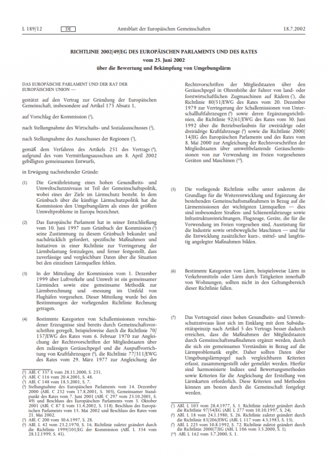

Mit der EG-Umgebungslärm-Richtlinie 2002/49/EG, im englischen: „Environmental Noise Directive“, oder kurz: **END**, verpflichten sich alle Mitgliedstaaten der EU, mindestens alle 5 Jahre (ab 2007, 2012, …) folgende drei Aktivitäten durchzuführen: 
1.	**Lärmkartierung**: Erstellung einer Bestandsaufnahme des Lärms, der auf die Bevölkerung in Wohngebieten einwirkt. Hierbei werden Lärmkarten erstellt, auf denen erkennbar ist, wo besonders starke Lärmbelästigung vorherrscht und wo Ruhige Gebiete zu finden sind.
2.	**Lärmaktionsplanung**: Die Beteiligung der Öffentlichkeit an der Lärmaktionsplanung erfolgt auf Grundlage der Lärmkarten, es werden gemeinsam Lärmaktionspläne erstellt. Die Lärmaktionspläne beinhalten Maßnahmen zur Lärmbekämpfung, sowie zum Schutz Ruhiger Gebiete.
3.	**Information**: Die Mitgliedstaaten informieren die Öffentlichkeit bestmöglich über Lärmbelastungen und Lärmauswirkungen.

> In Deutschland werden diese Aufgaben nicht von einer einzigen Behörde wahrgenommen, sondern von weit über 1.000 Behörden: eine Handvoll Bundesbehörden, Dutzende Landesbehörden und viele tausend Gemeindebehörden. <cite><a href=“http://ruhige-gebiete.de/downloads/Dissertation_MARTIN_JAESCHKE_aktualisierte_Zusammenfassung_050814.pdf“>Martin Jaeske</a></cite>
