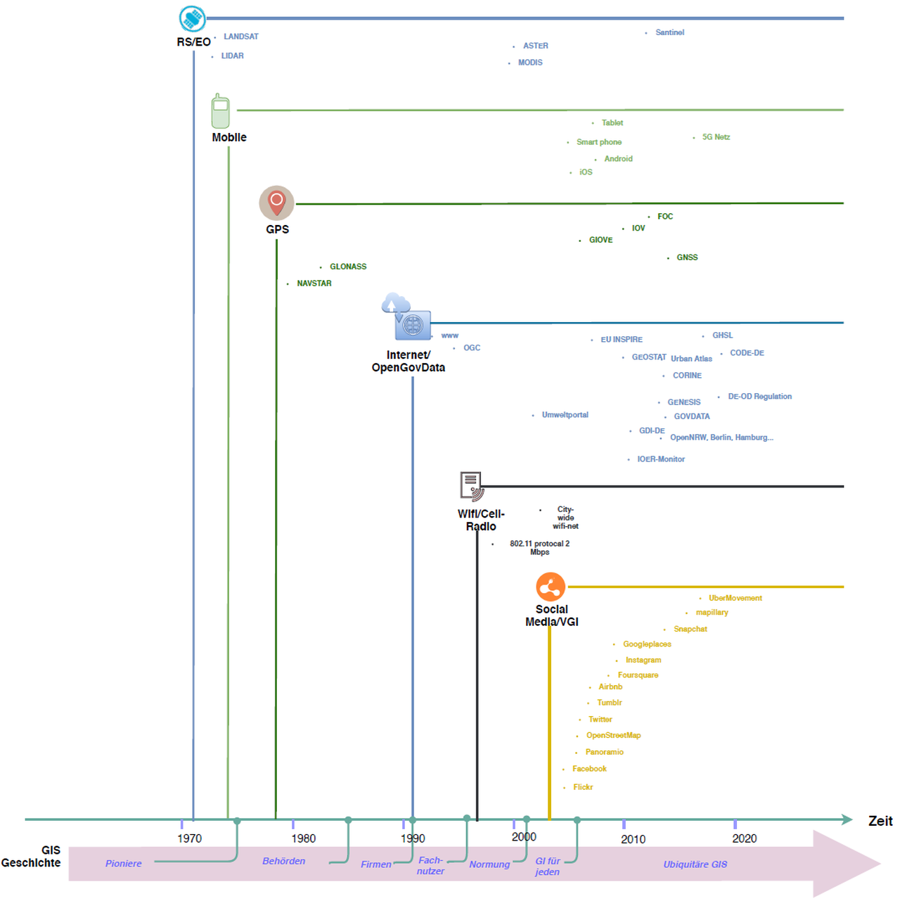

### Lokal/Regional:
Die Bundesländer und Gemeinden sind häufig ebenfalls aktiv in der Open-Data-Initiative, z.B. Hamburg, Berlin, Nordrhein-Westfalen, Thüringen, Rheinland-Pfalz oder u.a. die Gemeinden Aachen, Bonn, Köln, Moers und Rostock (eine Übersicht gibt das [OpenGeoEdu-Datenportal](https://portal.opengeoedu.de/)).

### National:
Die nationalen Akteure, wie u.a. das Bundesamt für Kartographie und Geodäsie ([BKG](https://www.bkg.bund.de/)) oder das Statistische Bundesamt ([DESTATIS](https://www.destatis.de/)), stellen offene Geobasis- und Statistikdaten bereit – von Flächennutzungs-, über Gebäude- bis hin zu Verkehrsdaten. Dennoch existiert hier eine Vielzahl von Nutzungslizenzen, Diensten und Datenqualitäten.

### International:
Daten werden insbesondere von der Europäischen Statistikbehörde ([eurostat](http://ec.europa.eu/eurostat/de/data/database)), der europäischen Umweltagentur ([EEA](https://www.eea.europa.eu/data-and-maps)), der Organisation für wirtschaftliche Zusammenarbeit und Entwicklung ([OECD](https://data.oecd.org/)) und in Geoportalen anderer Europäische Union (EU)-Staaten angeboten. Dazu gehören z.B. die Datenprodukte von Copernicus ([Urban Atlas](http://copernicus.eu/data-access-satellite)). Zudem existieren  weltweite Datenangebote wie Flickr, OpenStreetMap ([OSM](https://www.openstreetmap.de/)), Global Human Settlement Layer  ([GHSL](https://ghsl.jrc.ec.europa.eu/)), Global Urban Footprint ([GUF](https://www.dlr.de/eoc/desktopdefault.aspx/tabid-11725/20508_read-47944/)), "Nighttime Imagery", Höhenmodelle und weitere Produkte auf Grundlage von Volunteered geographical information ([VGI](https://de.wikipedia.org/wiki/Volunteered_geographic_information)).

<!--
<iframe src="https:/www.learn.opengeoedu.de/pages/07.Monitoring/01.vorlesung/03.datenangebote/ opendata_trend_de.html" style="width:100%; height: 600px"></iframe>

-->

! Entdecken Sie sich auf das Thema **Offene Geodaten** unter Lehr Module: [Open XX](https://learn.opengeoedu.de/openx/vorlesung/opengeodata) und [Open Data](https://learn.opengeoedu.de/opendata/vorlesung/offene-geodaten)
