The IOER-Monitor offers the data on land use development on the basis of the ATKIS Basis-DLM in addition to the official land use statistics (since 1980 it is already existing as secondary statistical survey for all old federal states in Germany)

Some selected IÖR monitoring results can be presented as:

 

### Land use share for transport purpose within settlement-transport area (2017)

### Land use statistics (2011-2016)

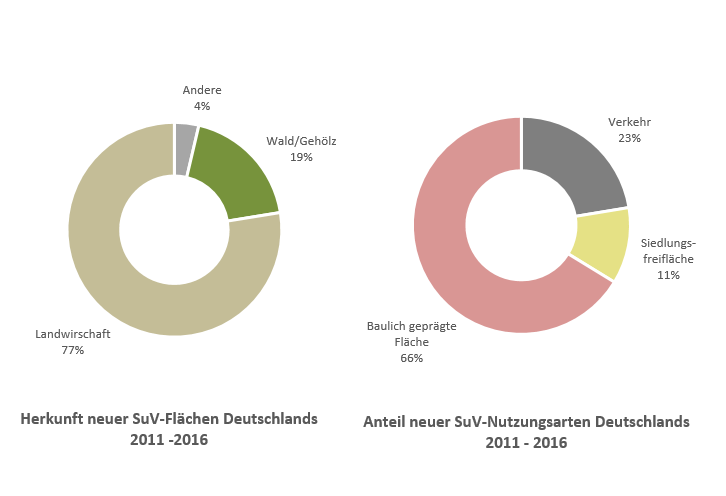

### Share of built-up "Settlement and Transport Landuse (SuV)" within flood affected areas: Spatial trend in the federal states

<!---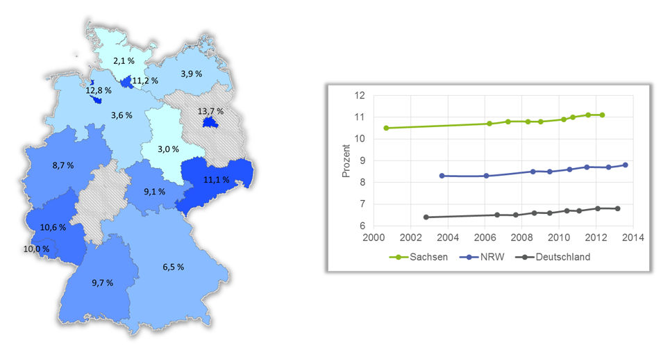 -->

<iframe src="https://h5p.org/h5p/embed/708933" width="1090" height="1461" frameborder="0" allowfullscreen="allowfullscreen"></iframe>

Here shows the percentage share of the built-up settlement and traffic landuse in the flood areas in the federal states of Germany.

### Newly built-up land use at lowest adminitrative ("Gemeinde") level (2014)
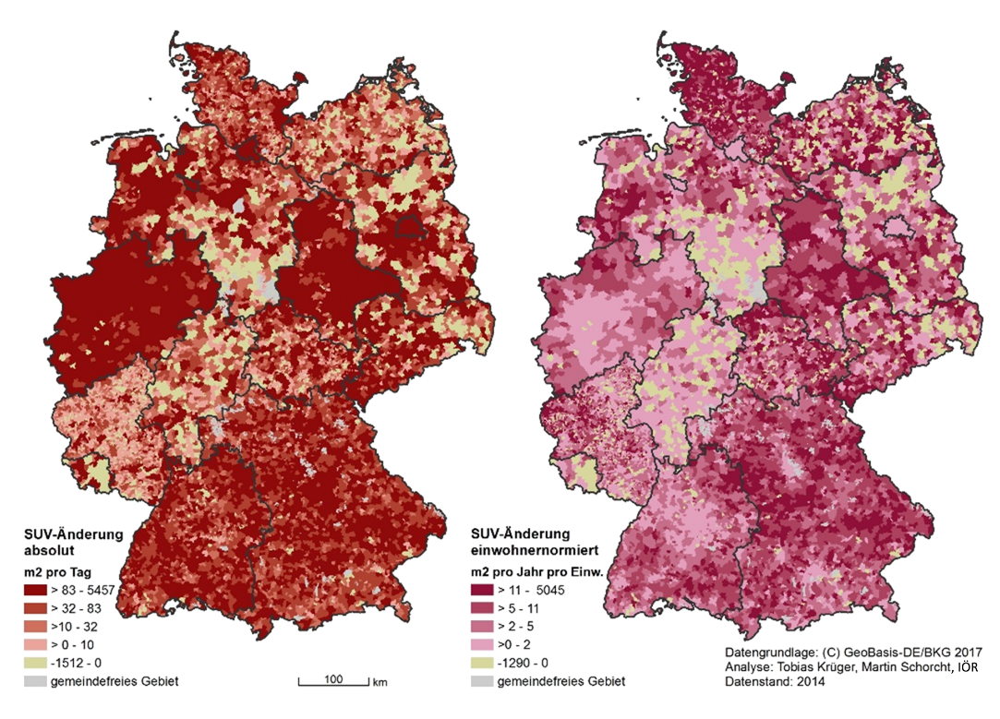

Here are some example of the newly built-up land use at  lowest adminitrative ("Gemeinde") level.

### Degree of Soil sealing at district level (2015)
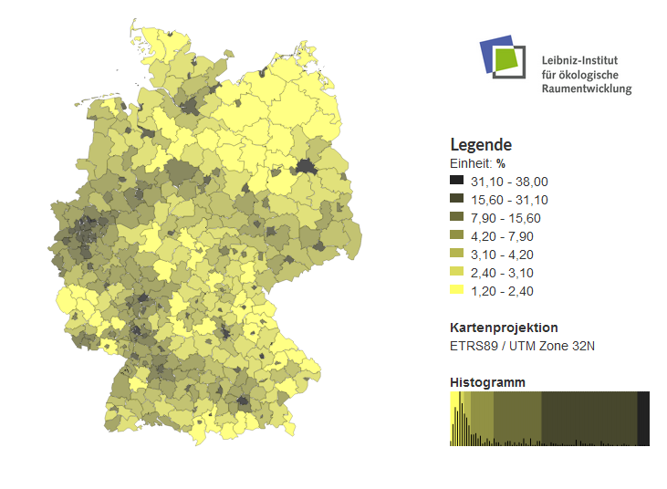

The degree of soil sealing (2015) is shown here at district level throughout Germany.

Below you can see the pattern in the degree of soil sealing degree a raster grid map (100*100m).

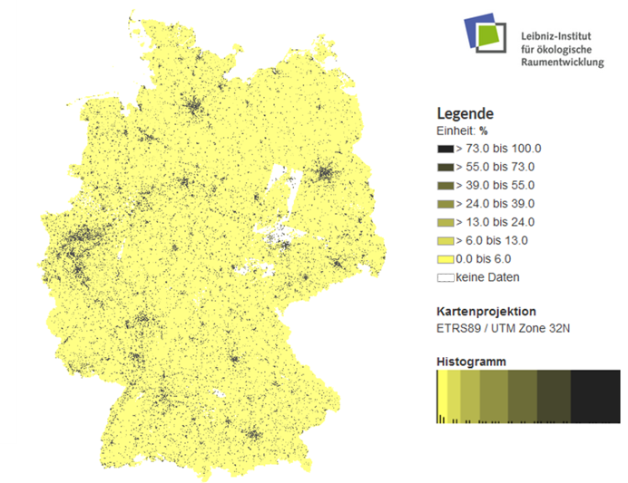

### Soil sealing in the state capital city - Dresden
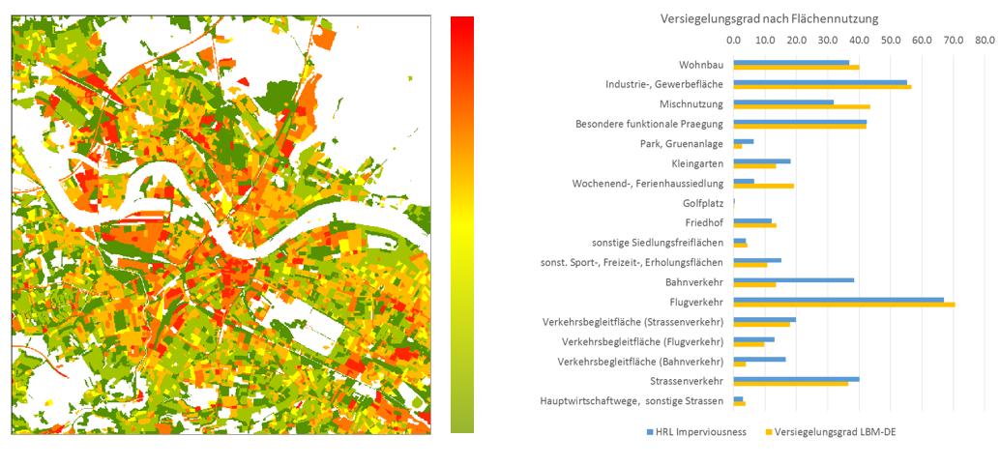

Here is a map of soil sealing in the state capital city - Dresden.

### Green space intensity per unit of area
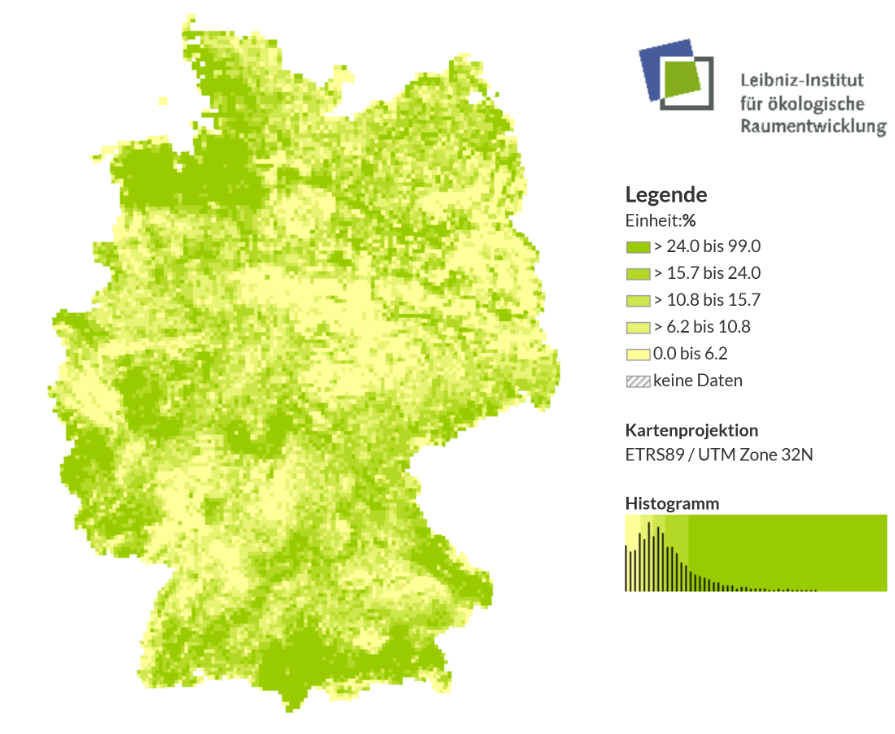

This map shows the share of Green space intensity per unit of area (5000*5000m Raster).

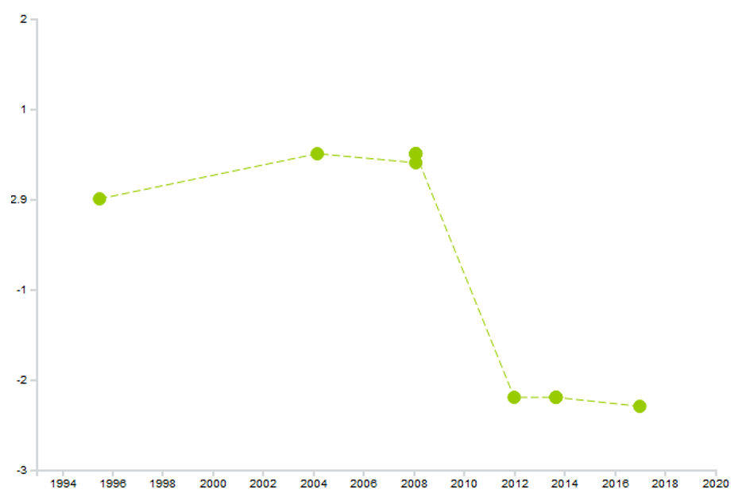

Here you can see the changes in the share of greenspace in % (German capital city - Berlin, 2016).

### Entwicklung der Siedlungsdichte und Bevölkerung
Here is an example for linking geodata. In this case, the settlement and transport area is linked to the population information from the official statistics. Settlement density is a measure of the efficiency of land use in the residential sector.

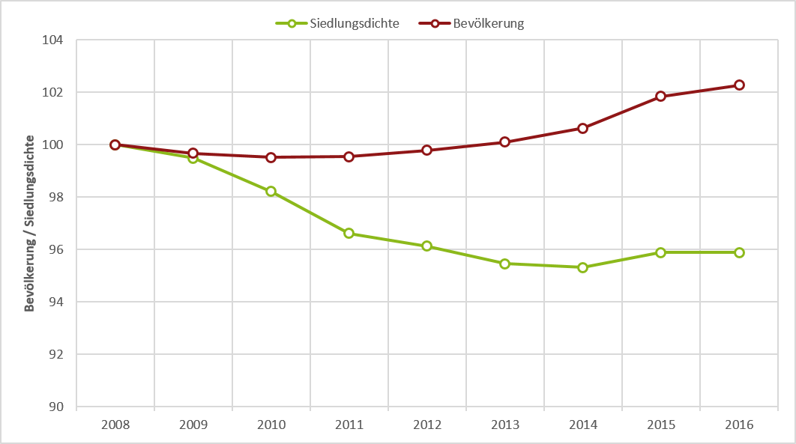

Here you can see the development of settlement density and population, differentiated by community size (below).

### Chages in the settlement density at lowest adminitrative "Gemeinde" level (2008-2015)
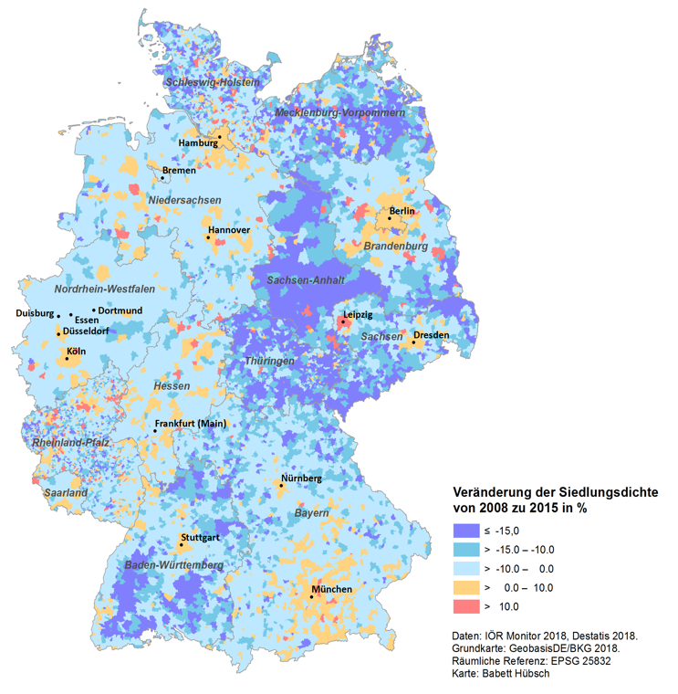

Here you can see the changes in the settlement density at lowest adminitrative "Gemeinde" level.

### Building classification
In this example, one can deduce the building type e.g. single-family house, block or row construction by means of classification from the size and layout of buildings- where the  the basic geodataset is Hausumringe (House layout).
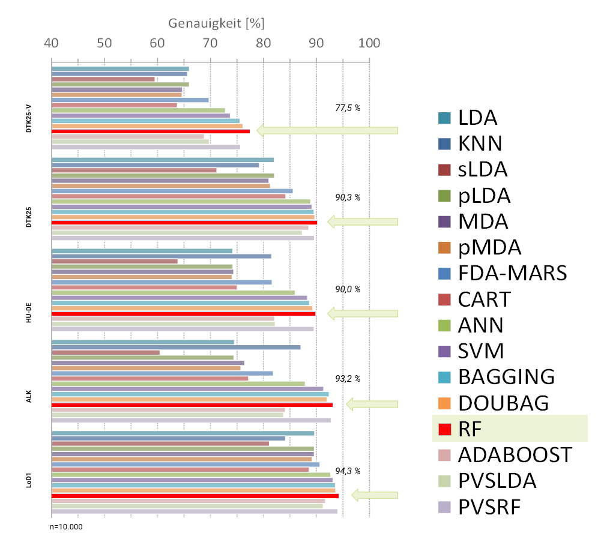

The challenges are: Regional differences, modelling differences, mixed use, acquisition of training and test data.

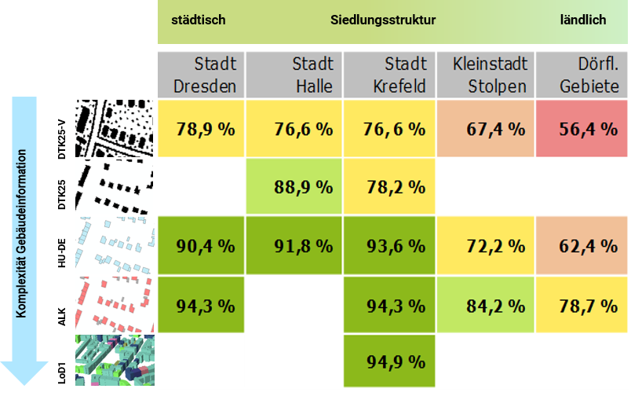

 

! **Further analysis examples of land use monitoring results can be found at:**  http://www.ioer-monitor.de/ergebnisse
