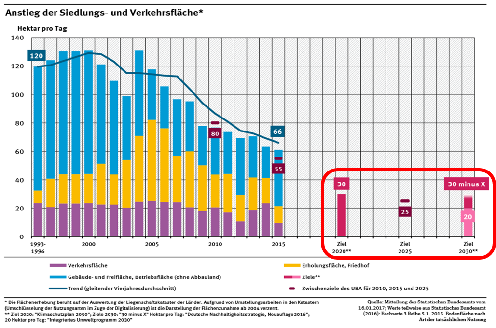

Fläche (Boden) ist eine begrenzte Naturressource. Nur die effiziente Allokation und Nutzungsintensität von Flächen sichern unsere Lebensgrundlage und den Umweltschutz ([GLTN, 2018](https://gltn.net/home/land-management-and-planning/#land-use-planning)). Dabei soll insbesondere die bauliche Entwicklung und die damit verbundenen Flächenneuinanspruchnahme mit besonderer Verantwortung erfolgen. So wird in dem nationalen Klimaschutzplan der Bundesregierung angestrebt, **bis 2050 das Netto-Null-Ziel** im Flächenverbrauch zu erreichen ([Meinel, et al., 2017](http://nbn-resolving.de/urn:nbn:de:bsz:14-qucosa2-172489)). Eine nachhaltige Siedlungsentwicklung, d. h. geringer Flächenverbrauch, Begrünung der Städte, Vermeidung von Zersiedelung durch Innen- vor Außenentwicklung, benötigt als Grundlage hochgenaue, kleinräumige Informationen zur Flächennutzung, zu Gebäuden sowie zur Verkehrsinfrastruktur.

Die Grafik zeigt den jährlichen Anstieg der Siedlungs- und Verkehrsfläche im Vergleich zur Erholungsfläche sowie die Flächensparziele  der Bundesregierung. Zur Prüfung und Erreichung dieser Ziele benötigen wir eine kleinräumige Raumbeobachtung und Bewertung der Siedlungsentwicklung um den Anforderungen aus Politik und Gesellschaft gerecht zu werden.

Die Bedeutung dieser Aufgabe spiegelt sich auch in der aktuellen Literatur wider.

!!! Zum Beispiel in [Siedentop & Kaup (2017)](http://nbn-resolving.de/urn:nbn:de:bsz:14-qucosa2-211777): ***„Staat, Gesellschaft, Wissenschaft und Wirtschaft benötigen eine leistungsfähige Raumbeobachtung, die Entscheidungsträgern und Interessierten Informationen zu demografischen, ökonomischen, sozialen sowie siedlungs- und infrastrukturellen Zuständen und Entwicklungen bereitstellt“.***
