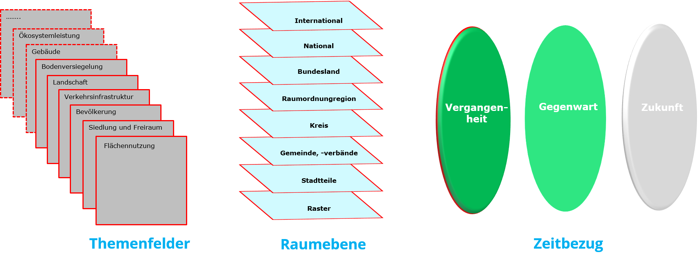

Ein kleinräumiges Flächenmonitoring benötigt Tools, Systematiken, Berechnungsvorschriften, leicht verständliche Geovisualisierung sowie Akteure auf allen Entscheidungsebenen.

Dabei kommt raumbezogenen Daten und geostatistischen Informationsangeboten eine besondere Bedeutung zu, die immer genauer sowie aktuell und kostenfrei verfügbar sein sollen.

Das Ziel der Übungen sind Analysen auf **Grundlage offener Daten in Kombination mit Geobasisdaten und Altkarten**. Die Bausteine dazu sind:
- (1) Grundlagen der Datenhaltung,
- (2) Räumliche Analyse und
- (3) Interaktive Anwendungen.

In den Übungen werden schrittweise relevante Themenfelder der thematischen Raumanalyse vorgestellt.

- **Datengrundlagen** zur Fläche, zu Gebäuden, zu Verkehrstrassen und zur Landbedeckung
- **Flächennutzungs**-, Verkehrs- und Gebäudenomenklaturen
- Beschreibung durch **Indikatoren (Eigenschaften)**
- Analysen in verschiedenen **Raumauflösungen (Verwaltungsgebiete, Verkehr)**
- Ergebnisdarstellung als **Karten, Tabellen, Entwicklungsgraphen**
