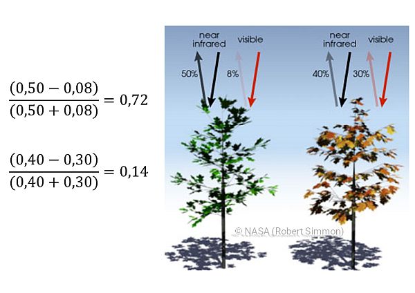

## Spektrale Eigenschaften von Vegetation

Jede Art von Materie oder Oberfläche reflektiert Strahlung, wenn auch in unterschiedlicher Stärke:
seien es Böden, Wasser (auch als Schnee und Eis), versiegelte Flächen wie Straßen und Gebäude, oder eben *Vegetation* wie Gras, und landwirtschaftliche Flächen oder Wälder.
Trifft Sonnenstrahlung auf ein Objekt oder Erdoberfläche, wird sie transmittiert, absorbiert bzw. in Energie umgewandelt und jeweils in bestimmten Wellenlängen unterschiedlich stark zurückgeworfen.

!!! Der Begriff der spektralen Signatur wird dabei oft als etwas Absolutes verstanden, was der Sache nicht immer gerecht wird. Zwar ist die wellenlängenabhängige Reflexion für viele Oberflächen und Landbedeckungsarten sehr typisch, allerdings spielen eine Reihe von Faktoren wie Betrachtungswinkel und Position der Sonne, Aufnahmezeitpunkt und Sensortyp entscheidende Rollen. Hinzu kommen die unterschiedlichen Ausprägungen des Zielobjekts.
Nehmen wir Waldbäume als Beispiel: Sie stehen mal dicht gedrängt, mal mit großen Lücken, auf flacher Ebene, an steilen Hängen; Jungpflanzen erscheinen dabei anders als alte Bäume. Und obwohl Unterschiede zwischen Baumarten signifikant sein können, gibt es nicht *die eine* Signatur für Fichte oder Buche. Der (situationsbedingte) Sachverhalt ist vielfältiger und sollte von Fall zu Fall betrachtet werden. Es kann nicht schaden, dies im Hinterkopf zu behalten.  

Die Reflektanzkurve von grüner gesunder Vegetation hat eine charakteristische Form und ist geprägt von Faktoren wie Konzentration an Blattpigmenten, Wassergehalt und Blattaufbau. Die folgende Abbildung zeigt das typische Erscheinen anhand einer spektralen Kurve einer Buchenkrone (Aberle 2017) samt Haupt-Einflussfaktoren.

<iframe src="https://h5p.org/h5p/embed/240206" width="100%" max-width=600 max-height="600" height=400 frameborder="0" allowfullscreen="allowfullscreen"></iframe>
  

## Vegetationsindizes
Die in der reflektierten Strahlung (z.B. Pixelwerte der einzelnen Sentinel-2 Bänder) enthaltenen Informationen können direkt oder über neu geschaffene Indizes untersucht werden. Spektrale Indizes verfolgen dabei das Prinzip einer Neuberechnung eines künstlichen Kanals, um spezielle Features (Merkmale) hervorzuheben. Sie werden meist als einfache lineare Kombinationen oder Brüche (Ratios) berechnet. Es gibt je nach Sensor und der Anzahl der Kanäle eine Vielzahl an möglichen Kombinationen.
Vegetationsindizes sind robuster gegenüber Beleuchtungsunterschieden oder atmosphärischen und Hintergrundeinflüssen (Bannari et al. 1995, Huete, 2012).  
Der wohl bekannteste Vegetationsindex ist der Normalized Difference Vegetation Index (NDVI) (Rouse, 1974). Er gilt als Standard des Vegetationsmonitorings und macht sich die Unterschiede beim (Gesundheits-)Status von Vegetation besonders im NIR zu nutze.
Der NDVI wird wie folgt berechnet:

*NDVI = (NIR - rot) / (NIR + rot)* ,  [-1;1]

!!!! Recherche von Indizes auf der [Index Database](https://www.indexdatabase.de/) für Sentinel-2 und weitere Sensoren. Suchen Sie sich Beispiele heraus und stellen Sie diese einander gegenüber. Vergleichen Sie Indizes auf dem [Sentinel Playground](https://apps.sentinel-hub.com/sentinel-playground/?source=S2&lat=50.03619419013074&lng=8.040962219238281&zoom=13&preset=1_NATURAL_COL0R&layers=B02,B12,B08&maxcc=20&gain=1.0&gamma=1.0&time=2015-01-01|2018-05-17&atmFilter=&showDates=false).
  

! Zum besseren Verständnis gibt es im Sentinel-Hub eine gute Übersicht über die einzelnen Kanäle, deren Kombinationsmöglichkeiten und Anwendungsbeispiele, sowie die Darstellung unterschiedlicher Vegetationsindizes: [Sentinel 2 EO products](https://www.sentinel-hub.com/develop/documentation/eo_products/Sentinel2EOproducts)
