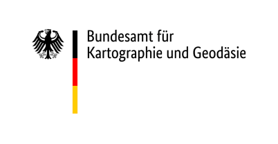

  

Das Bundesamt für Kartographie und Geodäsie (BKG) ist der zentrale Dienstleister des Bundes für topographische Grundlagendaten, Kartographie und geodätische Referenzsysteme. Auf den Gebieten der Geodäsie und des Geoinformationswesens berät das BKG die Einrichtungen des Bundes und vertritt die einschlägigen fachlichen Interessen des Bundes auf internationaler Ebene.  

Die Frage nach dem "Wo" begegnet uns nahezu überall. Eine Vielzahl von Aktivitäten im öffentlichen und privaten Bereich hat einen Raumbezug und beruht auf Geoinformationen – also auf Daten, die unsere Umwelt, unser Klima, Verkehrsinformationen oder unsere Wirtschaftsstruktur beschreiben. Die Fachabteilung Geoinformation des BKG entwickelt Verfahren, Produkte und Dienste, mit denen sich Geodaten hoch effizient nutzen und kombinieren lassen. Hier spielen auch Fernerkundungsdaten eine wichtige Rolle.

Fernerkundungsdaten können in vielfältigen Aufgabenbereichen genutzt werden:
-	zur regelmäßigen Veränderungsbeobachtung und Gewinnung von Umweltinformationen,
-	zum Ressourcenmanagement in Land- und Forstwirtschaft,
-	zur Kartierung und Planung von Siedlungen und Infrastrukturen und
-	im zivilen Schadensfall.  

Zurzeit verstärkt das BKG seine Aktivitäten im Bereich der satellitengestützten Fernerkundung und beteiligt sich u.a. am Copernicus-Erdbeobachtungsprogramm. Dabei stellt das BKG den Fachkoordinator für den Bereich Landüberwachung.

! Sie finden uns hier:  
! [https://www.bkg.bund.de](https://www.bkg.bund.de?target=_blank)  
! [https://twitter.com/BKG_Bund](https://twitter.com/BKG_Bund?target=_blank)  
  
