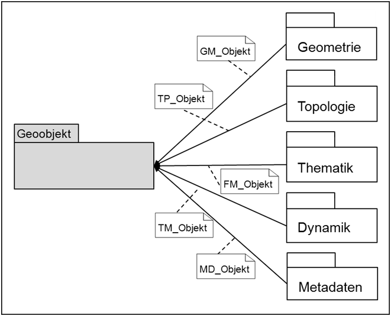

GIS today usually follow an object-based view. Standardization defines the spatial object (see [ISO 19109 Geographic information - Rules for application schema, 2013](https://en.wikipedia.org/wiki/ISO/TC_211_Geographic_information/Geomatics#Published_standards)).

!!! "A geoobject is understood to be a unit from the user's point of view, contained in a GIS, that is important for his work, which can be clearly described by means of geodata and identified and referenced in reality. The geoobject usually represents a concrete physical, geometrical or conceptually limited unit of the earth, in this sense it is unique in the real world and has a clear identity. A geoobject can be elementary or arbitrarily complex and the descriptive attributes of the geoobject can be both quantitative (e.g. geometric information) and qualitative (e.g. indication of a name or a soil type). Each geoobject can be assigned to a specific object class". (Bill, 2016: 18-19)

Common geoobjects in urban and spatial development may be, for example: buildings, parcels, building blocks, city quarters, cities. They are defined by the following components, illustrated by the example of buildings:

- **Geometric properties** describe the position and shape (as point, line, surface, body) of objects in space. A residential building can be defined by its surrounding polygon, a surface indicated by a sequence of 2D coordinates as vector data.
- **Topological properties** describe the relative spatial relationships of objects to each other, whereby geometry is abstracted. Thus the topology (nodes, edges, meshes, neighborhoods) supplements the position and form by neighborhood statements. The residential building could be described topologically by the data type 2-cell (mesh) as well as the neighbourhood relations to the street and the adjacent types of use.
- **Thematic properties** (as part of the semantics of an object) correspond to descriptive characteristics, attribute data or attributes. Different thematic descriptions can be assigned to the residential building, e.g. the descriptive attributes "base area, house number, number of floors, year of construction, building value".
- **Temporal properties** describe the time or period for which the other properties apply. The basis for this is the standard ISO 19108 Geoinformation - Temporal scheme, 2009. The dynamics of a residential building can be specified, for example, by specifying the year of construction, the date of the last renovation or the duration of its planned use. Of course, all other components of the object can also change over time, e.g. the geometry of the residential building through a subsequently added extension, which then also changes the base area attribute.
- **Metainformation** describe the object information and give information about their background and usability, so e.g. about their thematic classification, their IT-like structuring, the quality and topicality of the information describing the object, the form of the data acquisition and much more. The basis for this today is the standard DIN EN ISO 19115 Geoinformation - Metadata, 2011.

