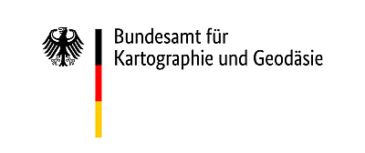

  

Das Bundesamt für Kartographie und Geodäsie (BKG) ist der zentrale Dienstleister des Bundes für topographische Grundlagendaten, Kartographie und geodätische Referenzsysteme. Auf den Gebieten der Geodäsie und des Geoinformationswesens berät das BKG die Einrichtungen des Bundes und vertritt die einschlägigen fachlichen Interessen des Bundes auf internationaler Ebene.  

Die Frage nach dem "Wo" begegnet uns nahezu überall. Eine Vielzahl von Aktivitäten im öffentlichen und privaten Bereich hat einen Raumbezug und beruht auf Geoinformationen – also auf Daten, die unsere Umwelt, unser Klima, Verkehrsinformationen oder unsere Wirtschaftsstruktur beschreiben. Die Fachabteilung Geoinformation des BKG entwickelt Verfahren, Produkte und Dienste, mit denen sich Geodaten hoch effizient nutzen und kombinieren lassen.  

Fernerkundungsdaten können zudem in vielfältigen Aufgabenbereichen genutzt werden:
-	zur regelmäßigen Veränderungsbeobachtung und Gewinnung von Umweltinformationen
-	zum Ressourcenmanagement in Land- und Forstwirtschaft
-	zur Kartierung und Planung von Siedlungen und Infrastrukturen
-	im zivilen Schadensfall  

Zurzeit verstärkt das BKG seine Aktivitäten im Bereich der satellitengestützten Fernerkundung und beteiligt sich u.a. am Copernicus-Erdbeobachtungsprogramm. Dabei stellt das BKG den Fachkoordinator für den Bereich Landüberwachung.

! Sie finden uns hier:  
[www.bkg.de](www.bkg.de)  
[https://twitter.com/BKG_Bund](https://twitter.com/BKG_Bund)  
  

### Das Fallbeispiel Fernerkundung & Copernicus
Die Landesfläche Deutschlands ist zu etwa einem Drittel mit Wald bedeckt. Die Ausdehnung der Wälder ist gut dokumentiert und lässt sich auch aus frei verfügbaren Daten mit hoher räumlicher Genauigkeit ableiten. Für die Erfassung des Waldzustands werden jedoch aktuellste Informationen benötigt, die in so großer Ausdehnung nicht in-situ erfasst werden können. Um großflächig die Gesundheit der Vegetation zu beobachten und nach Sturmereignissen oder Schädlingsbefall einen schnellen Überblick über betroffene Waldflächen zu erhalten, kommt daher die Fernerkundung zum Einsatz.

In diesem Fallbeispiel wird ein Sturmereignis vom August 2017 untersucht, bei dem es im Taunus (Hessen) zu größeren Sturmschäden im Wald kam. Dazu wird jeweils eine Sentinel-2-Szene von vor und nach dem Ereignis aufbereitet, analysiert und Vegetationsindizes für beide Zeitpunkte berechnet. Durch die Ermittlung der Differenzen zwischen den Indizes können die Schadensflächen identifiziert und auf Basis eines Schwellenwerts extrahiert werden. Anschließend erfolgt eine Verschneidung mit Landbedeckungsdaten, um das Ergebnis hinsichtlich der betroffenen Waldtypen zu quantifizieren. Abschließend werden die ermittelten Windwurfflächen in einer dreidimensionalen Geländeansicht visualisiert.

  

Diese Lerneinheit beinhaltet folgende __Lernziele__:

-	Recherche und Download
  - Satellitendaten des Copernicus Programms, Copernicus Landdienst, BKG Open Data
-	Verarbeitung von Sentinel-2 Daten in der freien Software SNAP & QGIS
  -	Maskierung von Fernerkundungsdaten anhand von Landbedeckungsdaten 
  -	Berechnung spektraler Indizes – Fernerkundung zum Vegetationsmonitoring
  -	Schwellenwertbasierte Klassifikation
  -	Quantifizierung von Schadensflächen
-	Erstellung einer dreidimensionalen Geländeansicht

