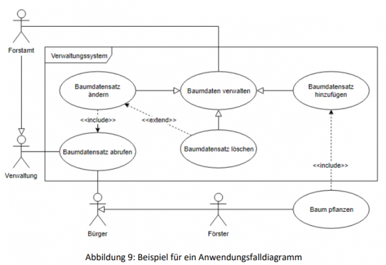
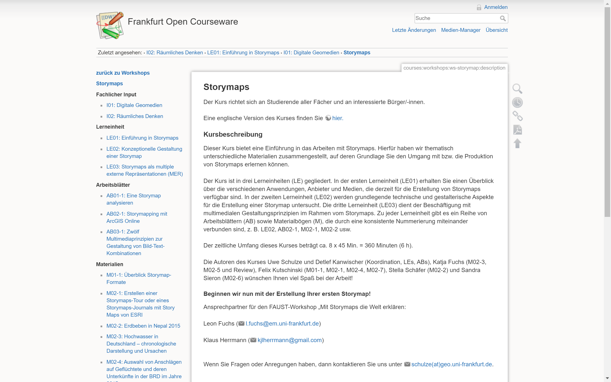

Auf dieser Seite finden Sie ausführliche Hilfestellungen zu verschiedenen Themen und Aufgaben in Geo-Informationssystemen. Neben eigenen Materialien stellen wir auch Verweise zu gut aufbereiteten externen Inhalten her.

[plugin:youtube](https://youtu.be/ZOTrDCiVma4)

Verfügbar sind:

## Thematische Kartographie

    

        <h4>Tutorial Kartengestaltung</h4>
        
Die vorliegende ausführliche Anleitung erläutert, wie die Ergebnisse einer Analyse in
            einer thematischen Karte aufgearbeitet
            werden können. Dabei gehen wir vom Vorhandensein verschiedener Daten oder Analyseergebnisse aus und zeigen
            wie
            mittels ArcMap (Version 10.3) Karten erstellt werden können. Als Datensätze nutzen wir die Ladestationen
            (ein
            Punktthema) und die Ergebnisse der Erreichbarkeitsanalyse (ein Polygonthema) auf kommunaler Ebene. Dies
            kombinieren
            wir vor eine Hintergrundkarte und illustrieren welche Elemente zu einer Karte gehören und mit welchen
            Signaturen
            oder Farbabstufungen gearbeitet werden kann. Das Ergebnis – eine Kombination einer Übersichts- und einer
            Detailkarte
            – sehen Sie hier. 

        
Download des Tutorials [Kartengestaltung](OGE-Tutorial_Kartengestaltung.pdf?target=_blank)

        
Download Tutorial [Designing thematic maps](OGE-Tutorial_Kartengestaltung-en.pdf?target=_blank)

    

    

    

        <h4>Tutorial Kartographie</h4>
        
Zur Erstellung anspruchsvoller kartographischer Produkte als Visualisierungsform der
            GIS-Analysen sind kartographische Grundkenntnisse essentiell. Dieses Skript stellt wesentliche Aspekte der
            thematischen Kartographie zusammen. Dabei werden Lehrmaterialien der Professur für Geodäsie und
            Geoinformatik in Präsenz- und Fernstudium genutzt.
            Dies ersetzt natürlich keine Lehrveranstaltung Kartographie. Daher wird das Studium kartographischer
            Lehrbücher nahegelegt.

        
Download des Tutorials [Kartographie](OGE-Tutorial_Kartographie.pdf?target=_blank)

    

    

---

## Modellierung

    

        <h4>Modellierung in UML und ER</h4>
        
In dieser Lerneinheit werden die wesentlichen Grundzüge der Modellierung vorgestellt
            und am Beispiel der Unified Modeling Language (UML) und des Entity-Relationship-Modells (ER) erläutert.

        
Download des Tutorials [UML und ER](OGE-Tutorial_UML_Vorlesung.pdf?target=_blank)

        
Download Tutorial in English [Modeling in UML and ER](OGE-Tutorial_UML_Vorlesung-en.pdf?target=_blank)

    

    

    

        <h4>UML-Klassen- und Aktivitätsdiagramm</h4>
        
In dieser Lerneinheit sollen Sie die in dem Vorlesungstutorial erlernten Grundlagen zum UML-Klassen- und UML-Aktivitätsdiagramm praktisch anwenden.

        
Download des Tutorials [Klassendiagramm](OGE-Tutorial_UML_%C3%9Cbung.pdf?target=_blank)

    

    

---

## Koordinaten

    

        <h4>Kartennetzentwürfe und Koordinatensysteme</h4>
        
In dieser Lerneinheit soll das Problem der Abbildung der gekrümmten Erdfigur auf eine
            Ebene oder eine andere Ersatzfigur erläutert (Kartennetzentwürfe) sowie gängige Koordinatensysteme
            beschrieben werden.

        
Download des Tutorials [Koordinaten](OGE-Tutorial_KNE_Koordinaten.pdf?target=_blank)

    

    

---

## Datenformate

    

        <h4>Tutorial Datenformate</h4>
        

            In diesem Tutorial werden gängige Datenformate beschrieben und deren Nutzung bei der Verarbeitung offener
            Geodaten erläutert.
            Zudem werden Tipps und Tricks gesammelt, um die gemeinsame Verarbeitung der Daten zu erleichtern.
        

        
Download des Tutorials [Datenformate](OGE-Tutorial_Dateiformate.pdf?target=_blank)

        
Download Tutorial in English [Data formats](OGE-Tutorial_Dateiformate-en.pdf?target=_blank)

    

    

        “Person”: {
        "name": "John Smith",
        "isAlive": true,
        "age": 25,
        "address": {
        "cityStreet": "New York, 21 2nd Street",
        "postalCode": "10021-3100"
        },
        "children": [ ],
        "spouse": null
        }
    

---

## OGC-Webservices

    

        <h4>OGC-Webservices</h4>
        
In dieser Lerneinheit sollen gängige OGC-Webservices beschrieben und deren Nutzung bei
            der Verarbeitung offener Geodaten erläutert werden. Zudem werden Tipps und Tricks im Umgang mit OGC-WxS
            gesammelt.

        
Download des Tutorials [OGC-Webservices](OGE_Tutorial_OGC_WxS.pdf?target=_blank)

        
Download Tutorial in English [OGC Web Services](OGE_Tutorial_OGC_WxS-en.pdf?target=_blank)

    

    

---

## Lizenzen

    

        <h4>Tutorial Lizenzen</h4>
        
In diesem Tutorial werden gängige Lizenzen für offene Daten und Software beschrieben und 
            deren Bedeutung bei der Verarbeitung offener Geodaten erläutert.

        
Download des Tutorials [Lizenzen](OGE-Tutorial_Lizenzen.pdf?target=_blank)

        
Download Tutorial in English [Licenses](OGE-Tutorial_Lizenzen-en.pdf?target=_blank)

    

    

---

## Externe Materialien

An dieser Stelle werden Verknüpfungen zu externen Inhalten bereitgestellt, die das Anliegen von OpenGeoEdu und das Arbeiten mit offenen Geodaten befördern.

    

        <h4>Tutorial Storymap</h4>
        
Das Geomedienlabor der Goethe Universität Frankfurt stellt in der Onlineplattform Frankfurt Open Courseware (FOC) einen Online-Kurs zur Einführung in das Arbeiten mit Storymaps für Studierende aller Fächer und interessierte Bürger /-innen frei zur Verfügung. Story Maps sind eine interessante Alternative für Belegarbeiten, da sie interaktive online-Karten mit verschiedenen Medien, wie z.B. Bildern, Texten, Videos und Links, verknüpfen und so raumbezogene Fragestellungen übersichtlich und in einer verständlichen Art und Weise präsentieren können.

        
Weiter zum Tutorial <a href="http://foc.geomedienlabor.de/doku.php?id=courses:workshops:ws-storymap:description">Storymap</a>

    

    

    

        <h4>Tutorial Learn ArcGIS</h4>
        
Learn ArcGIS stellt eine Sammlung von interessanten und didaktisch gut aufbereiteten raumbezogenen Fallbeispielen in Form von Lektionen zusammen. Die Lektionen werden in verschiedenen Sprachen  angeboten und beinhalten Schritt-für-Schrittanleitungen und entsprechende Datensätze. Mit einer kleinen Suchmaske kann die Lektionengalerie nach passenden Beispielen zu eigenen Fragestellungen durchsucht werden.

        
Weiter zu [Learn ArcGIS](https://learn.arcgis.com?target=_blank)

    

    

