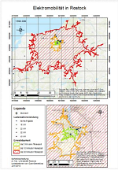
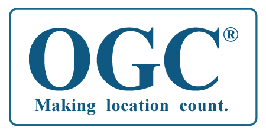

On this page you will find detailed help on various topics and tasks in geo-information systems.

[plugin:youtube](https://youtu.be/ZOTrDCiVma4)

Available tutorials you can find below: 

<!-- ## Thematische Kartographie

    

        <h4>Tutorial Kartengestaltung</h4>
        
Die vorliegende ausführliche Anleitung erläutert, wie die Ergebnisse einer Analyse in
            einer thematischen Karte aufgearbeitet
            werden können. Dabei gehen wir vom Vorhandensein verschiedener Daten oder Analyseergebnisse aus und zeigen
            wie
            mittels ArcMap (Version 10.3) Karten erstellt werden können. Als Datensätze nutzen wir die Ladestationen
            (ein
            Punktthema) und die Ergebnisse der Erreichbarkeitsanalyse (ein Polygonthema) auf kommunaler Ebene. Dies
            kombinieren
            wir vor eine Hintergrundkarte und illustrieren welche Elemente zu einer Karte gehören und mit welchen
            Signaturen
            oder Farbabstufungen gearbeitet werden kann. Das Ergebnis – eine Kombination einer Übersichts- und einer
            Detailkarte
            – sehen Sie hier. 

        
Download des Tutorials [Kartengestaltung](OGE-Tutorial_Kartengestaltung.pdf?target=_blank)

    

    

    

        <h4>Tutorial Kartographie</h4>
        
Zur Erstellung anspruchsvoller kartographischer Produkte als Visualisierungsform der
            GIS-Analysen sind kartographische Grundkenntnisse essentiell. Dieses Skript stellt wesentliche Aspekte der
            thematischen Kartographie zusammen. Dabei werden Lehrmaterialien der Professur für Geodäsie und
            Geoinformatik in Präsenz- und Fernstudium genutzt.
            Dies ersetzt natürlich keine Lehrveranstaltung Kartographie. Daher wird das Studium kartographischer
            Lehrbücher nahegelegt.

        
Download des Tutorials [Kartographie](OGE-Tutorial_Kartographie.pdf?target=_blank)

    

    

---

## Modellierung

    

        <h4>Modellierung in UML und ER</h4>
        
In dieser Lerneinheit werden die wesentlichen Grundzüge der Modellierung vorgestellt
            und am Beispiel der Unified Modeling Language (UML) und des Entity-Relationship-Modells (ER) erläutert.

        
Download des Tutorials [UML und ER](OGE-Tutorial_UML_Vorlesung.pdf?target=_blank)

    

    

    

        <h4>UML-Klassen- und Aktivitätsdiagramm</h4>
        
In dieser Lerneinheit sollen Sie die in dem Vorlesungstutorial erlernten Grundlagen zum UML-Klassen- und UML-Aktivitätsdiagramm praktisch anwenden.

        
Download des Tutorials [Klassendiagramm](OGE-Tutorial_UML_%C3%9Cbung.pdf?target=_blank)

    

    

---

## Koordinaten

    

        <h4>Kartennetzentwürfe und Koordinatensysteme</h4>
        
In dieser Lerneinheit soll das Problem der Abbildung der gekrümmten Erdfigur auf eine
            Ebene oder eine andere Ersatzfigur erläutert (Kartennetzentwürfe) sowie gängige Koordinatensysteme
            beschrieben werden.

        
Download des Tutorials [Koordinaten](OGE-Tutorial_KNE_Koordinaten.pdf?target=_blank)

    

    

--- -->

## Data formats

    

        

            This tutorial describes common data formats and explains how to use them when processing open geodata.
            In addition, tips and tricks are provided to facilitate the collective processing of the data.
        

        
Download Tutorial [Data formats](OGE-Tutorial_Dateiformate-en.pdf?target=_blank)

    

    

        “Person”: {
        "name": "John Smith",
        "isAlive": true,
        "age": 25,
        "address": {
        "cityStreet": "New York, 21 2nd Street",
        "postalCode": "10021-3100"
        },
        "children": [ ],
        "spouse": null
        }
    

---

## OGC-Web Services

    

        
This course unit describes common OGC Web Services and explains their use when processing open geodata. Tips and tricks for using OGC-WxS will be also covered.

        
Download Tutorial [OGC Web Services](OGE_Tutorial_OGC_WxS-en.pdf?target=_blank)

    

    

--- -->

## Licenses

    

        
In this tutorial, common licenses for open data and software are described and their relevancce for the processing of open geodata is explained.

        
Download Tutorial [Licenses](OGE-Tutorial_Lizenzen-en.pdf?target=_blank)

    

    

---
 
 
[center]
## We are working hard to provide more tutorials!
[/center]
